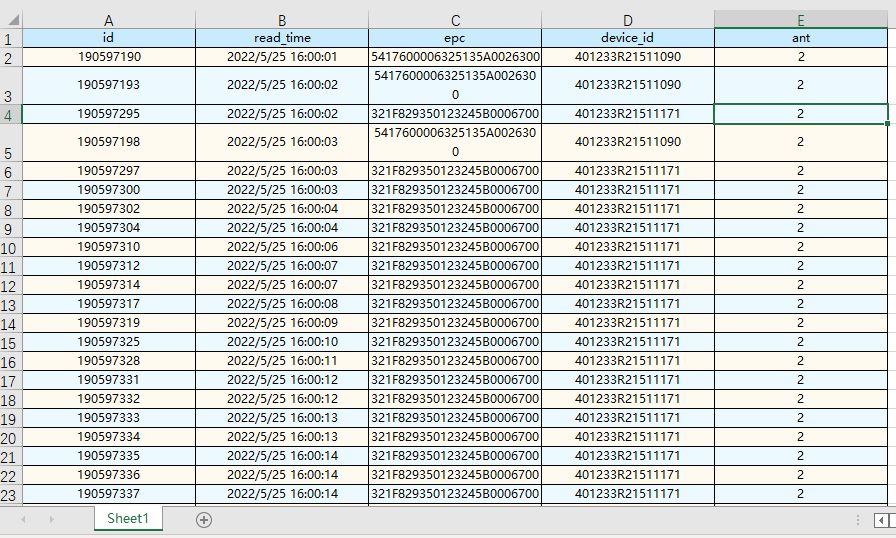
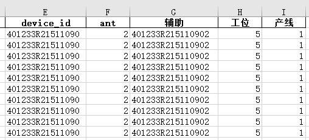
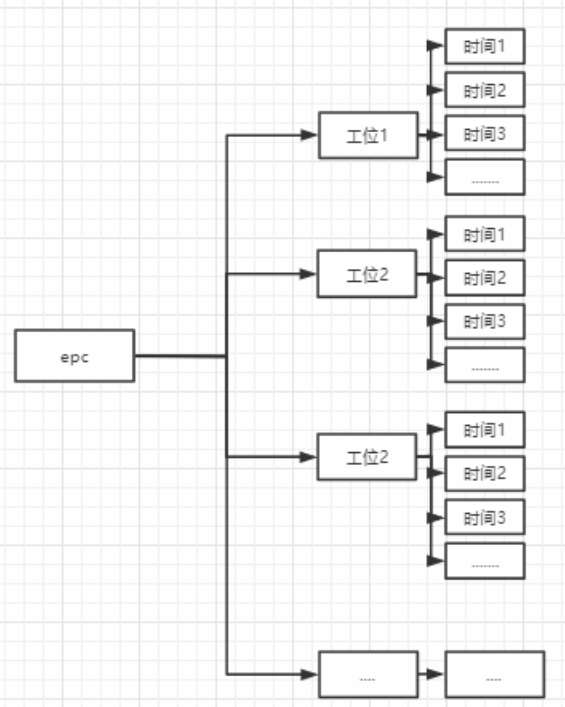

## 数据分析步骤
- 将 `device_id` + `ant` 得到辅助列,如 `device_id` 为 `401233R21511165` 和 `ant` 为 `3` 生成的辅助为`401233R215111653`

    

- 根据辅助列匹配另外的表格获得产线列。将同一产线的数据导出获得表格。最后获得的表格形式:  
    
- 获得节拍,每一个epc映射a个工位，a个工位对应b个时间。   
      

- 对b个时间升序排列，用最后一个时间tn - 第一个时间t1，获得的时间差称为该epc在工位a的节拍。  
已知某epc在某工位的节拍数据，取出该工位上的所有时间节点`list[] `  
>t0=list[0]  
>tn=list[-1]  

- 取出t0开始，4秒内的数据，判断数据的个数。如果数据个数大于2，则继续取t0后5到8秒的数据，判断是否有1条数据，  
如果数据个数大于1，则继续取t0后9到12秒的数据，判断是否有1条数据。   
取出tn之前，4秒内的数据，判断数据的个数。如果数据个数大于2，则继续取tn前5到8秒的数据，判断是否有1条数据，   
如果数据个数大于1，则继续取tn前9到12秒的数据，判断是否有1条数据。  
如果t0与tn任意不满足则T=0。当t0与tn都确定后，计算时间差 `T=tn-t0`   
- 最后将得到的 `epc-工位` 与 `节拍` 写入excel即可。
